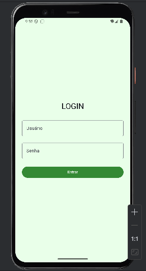
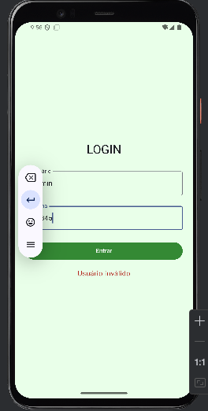
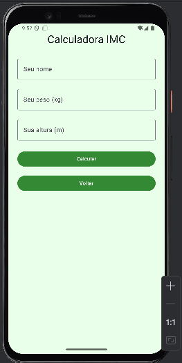
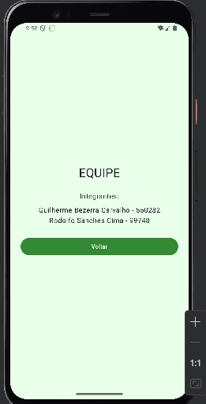

## 👨‍💻 Tecnologias Utilizadas
- **Kotlin**
- **Jetpack Compose**
- **Material 3**
- **Navigation Compose**
- **Android Studio Iguana / Koala**

## 👥 Alunos

- **Guilherme Bezerra Carvalho - RM 550282**
- **Rodolfo Sanches Cima - RM 99748**

## Prints
### Login & Login com Erro

    
    

### Menu

    

### IMC – Antes & Depois

    
    

###  Equipe

    

